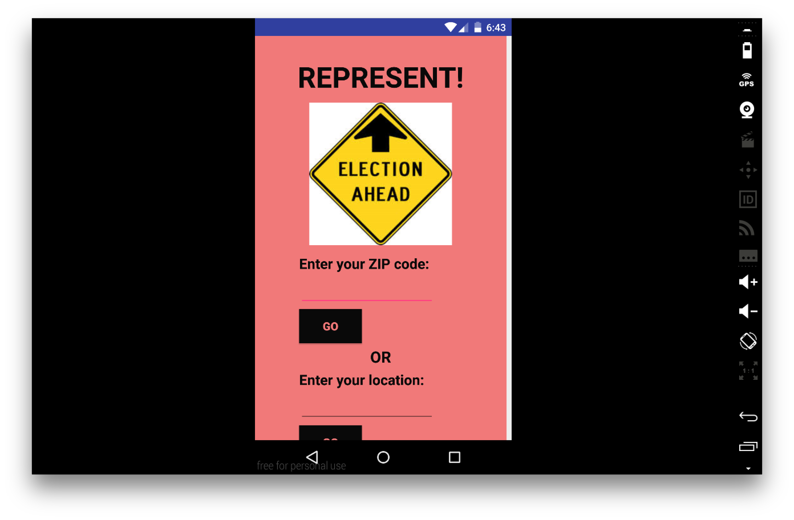
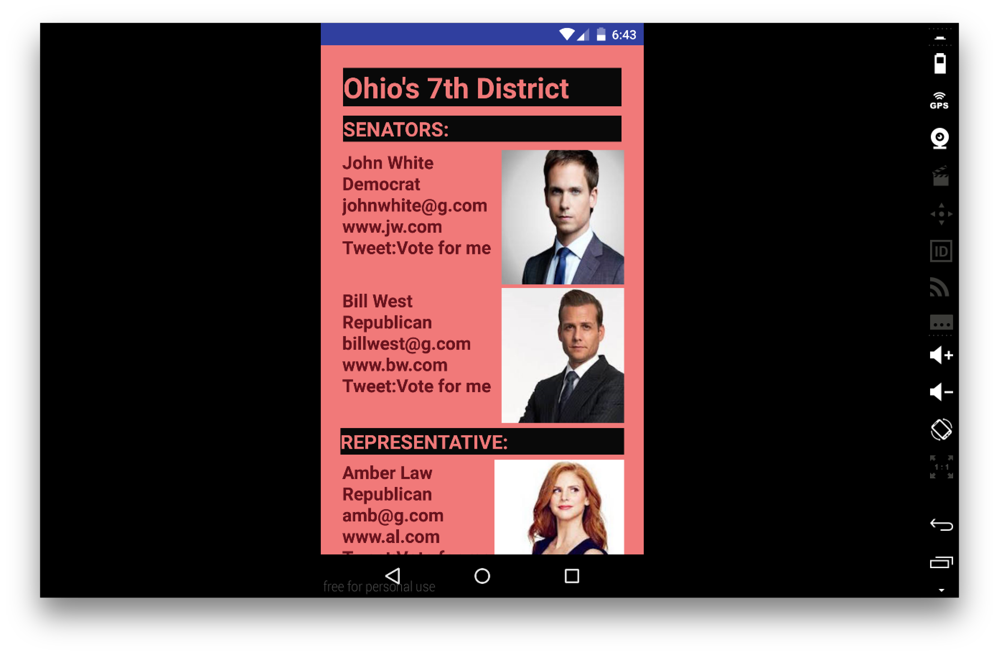
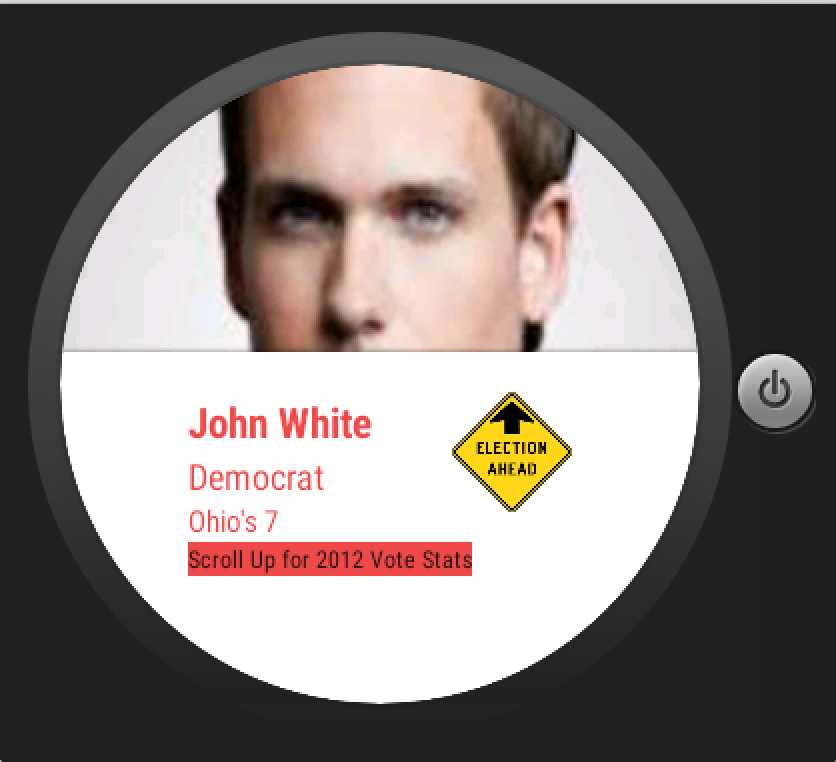
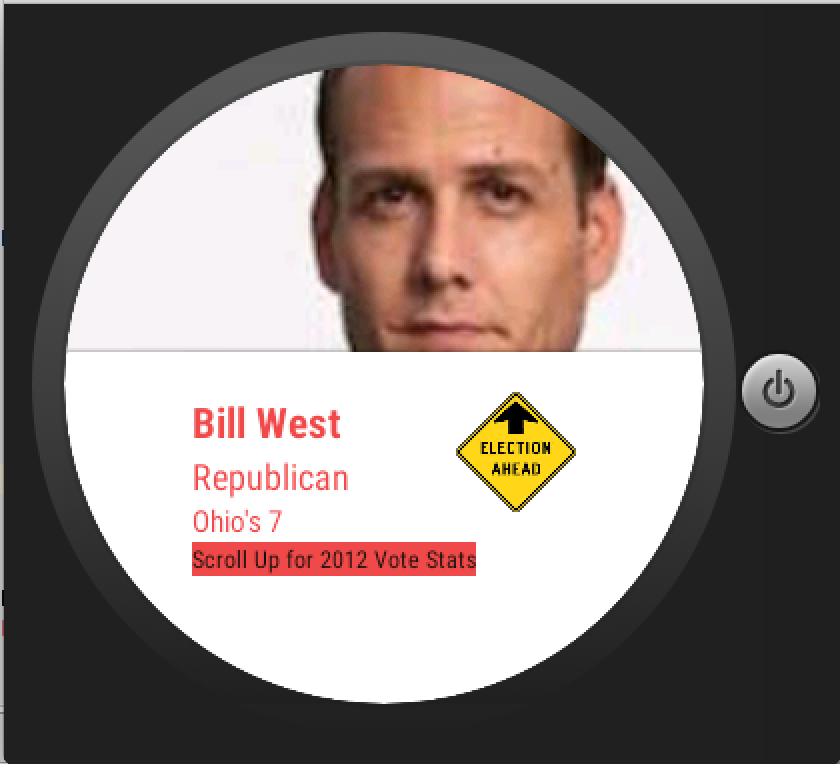
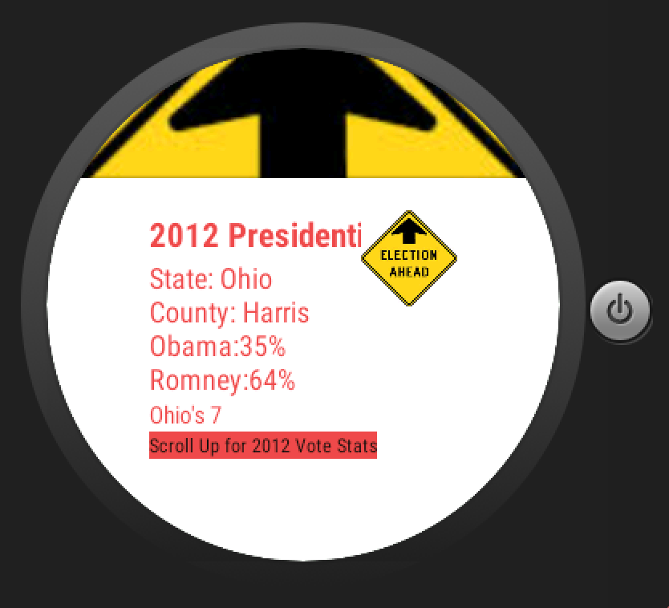
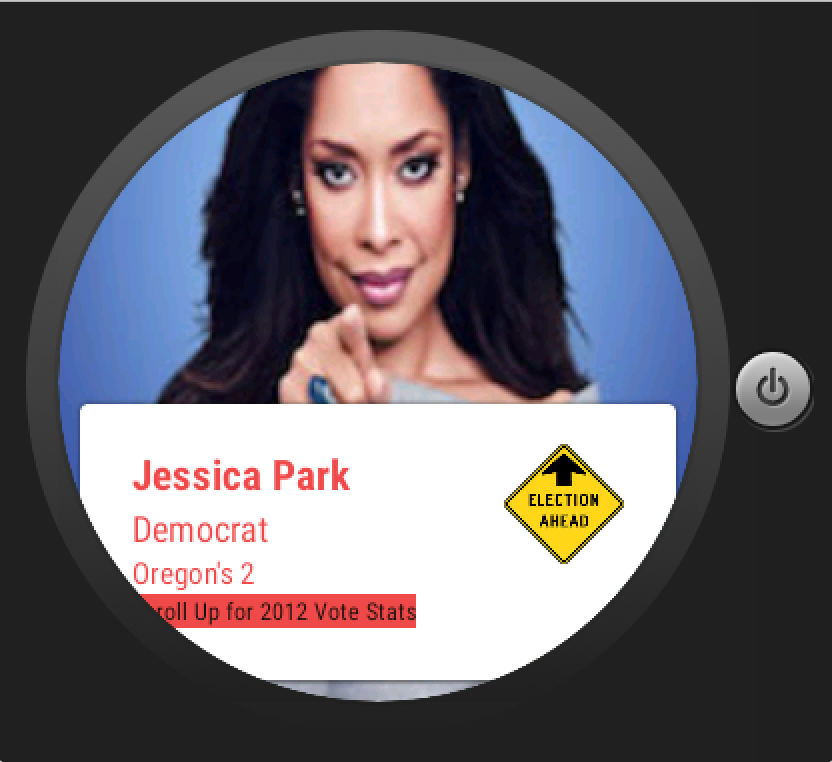
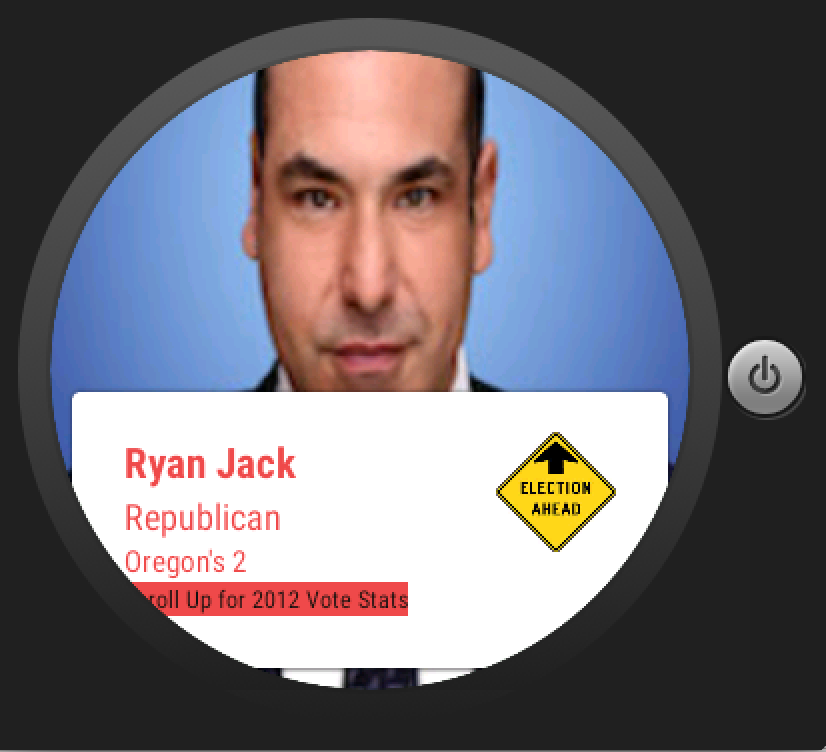
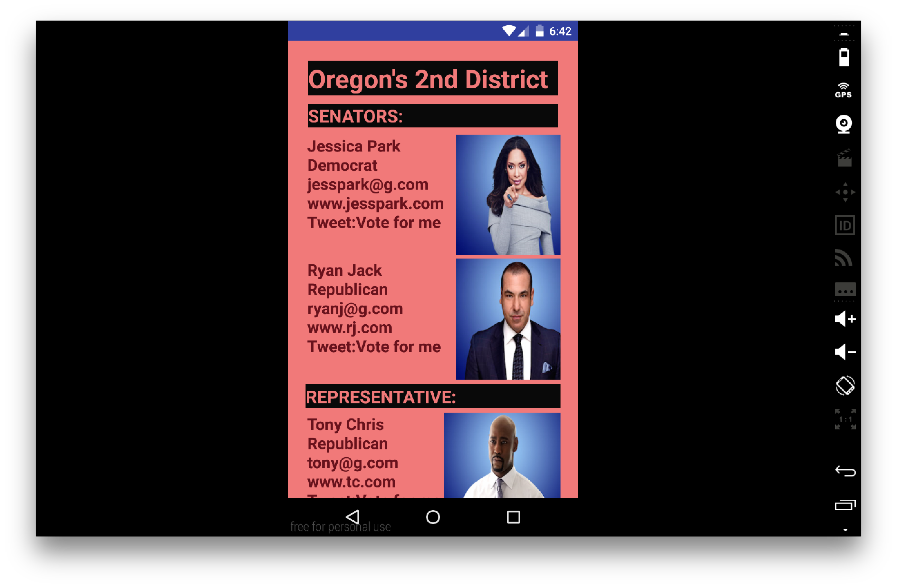

# PROG 02: Represent!

The Represent! App gives you details regarding the upcoming 2016 U.S Presidential elections. In the main view of the phone, you can either enter the ZipCode or your current location to find out the candidate details of that location. On clicking Go, it takes you to the Congressional View where you can see the two senator and one representative of that location. On clicking on a candidate, it takes you to the detail view of that candidate. When you enter the ZipCode or your current location on your phone, the candidate infrmation also appear on your phone, where you can swipe through to see all the candidates. When you click on a candidate on the watch, the deail view of that candidate appears on the phone. You can also scroll up to see the 2012 Presidential Vote Statistics. Another feature of the watch is that when you shake it, a random U.S location is selected and the appropriate candidate information appears on the phone and the watch.     

## Authors

Alagu Sanjana Haribhaskaran (alagusanjana@berkeley.edu)

## Demo Video

See [your demo video title here] (https://link_to_your_video)

## Screenshots
This is the main view of the app on the phone. 
                                              

This is the Congressional View that you get after entering the ZipCode or location.
                                       

These are the Detail Views of the candidates that you get by clicking on them. 
                                                
                         

The information about the candidates can simulatneously be found on the watch. You can swipe through to see all the candidates. You can click on the candidate on the watch to get the detail view on the phone.
                                 
                                                       

You can scroll up to get the 2012 Presidential Vote statistics.                                                                    
                                             
                                       

When you shake the watch, it picks a random location and gives you candidte information on the watch and phone.                

## Acknowledgments

I would like to acknowledge the following source codes:                       
http://developer.android.com/training/wearables/ui/2d-picker.html                          
http://jasonmcreynolds.com/?p=388                    
http://stackoverflow.com/questions/34538901/android-wear-adding-icon-above-cardfragment                      
http://stackoverflow.com/questions/28419057/how-to-change-to-another-activity-when-pressing-on-a-gridviewpager                     
and also the Catnip source code.

